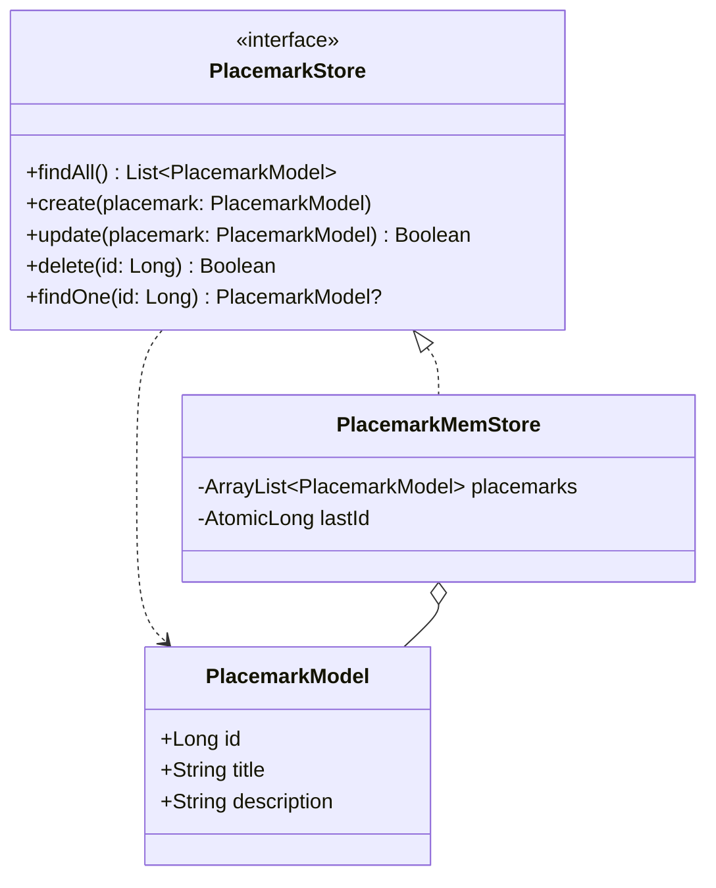

# Placemark UML Class Diagram

```mermaid
classDiagram
    class PlacemarkModel {
        +Long id
        +String title
        +String description
    }
    class PlacemarkStore {
        <<interface>>
        +findAll() List~PlacemarkModel~
        +create(placemark: PlacemarkModel)
        +update(placemark: PlacemarkModel) Boolean
        +delete(id: Long) Boolean
        +findOne(id: Long) PlacemarkModel?
    }
    class PlacemarkMemStore {
        -ArrayList~PlacemarkModel~ placemarks
        -AtomicLong lastId
    }
    PlacemarkStore <|.. PlacemarkMemStore
    PlacemarkStore ..> PlacemarkModel
    PlacemarkMemStore o-- PlacemarkModel
```